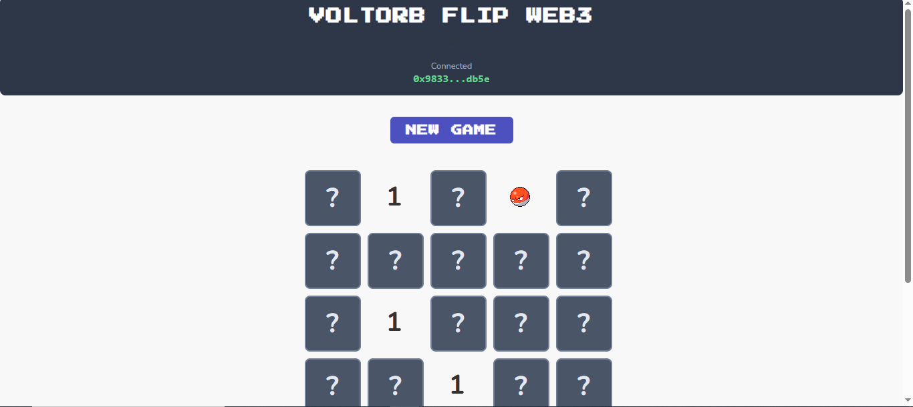

# Web3 Voltorb Flip - A Decentralized Game

## Project Description

This project is a decentralized application (DApp) that brings the classic "Voltorb Flip" mini-game to the blockchain. The core game logic, including board state and scoring, is managed by a Solidity smart contract deployed on the Ethereum Sepolia testnet.

The frontend is built with **Vanilla JavaScript, HTML, and CSS**, providing a lightweight, fast, and reliable user experience without the overhead of modern frameworks. This project demonstrates core Web3 functionalities, including smart contract development, deployment, and direct frontend interaction using Ethers.js.

---

## Live Demo

**(You can deploy this Vanilla JS frontend to GitHub Pages or Netlify/Vercel very easily later. For now, we can leave this.)**

Live demo coming soon!

---

## Features

*   **Wallet Connection:** Connects to user's MetaMask wallet.
*   **On-Chain Game Logic:** `startGame` function initializes a new, pseudo-randomized 5x5 game board on the smart contract.
*   **Interactive Gameplay:** `flipTile` function allows users to reveal tiles, with outcomes (coins or Voltorb) and scoring managed immutably on the blockchain.
*   **Event-Driven Updates:** The frontend will listen for smart contract events (`GameStarted`, `TileFlipped`, `GameOver`) to update the UI.
*   **Lightweight Frontend:** A fast and stable user interface built with only HTML, CSS, and Vanilla JavaScript.

---

## Tech Stack

**Smart Contract (Backend):**
*   **Solidity:** Language for smart contract development.
*   **Hardhat:** Ethereum development environment for compilation and deployment.
*   **OpenZeppelin Contracts:** Utilized for standard `Ownable` contract.
*   **Ethereum Sepolia Testnet:** The public testnet for deployment and gameplay.

**Frontend:**
*   **Vanilla JavaScript (ES6+):** For all application logic and DOM manipulation.
*   **Ethers.js (v5, via CDN):** A robust library for interacting with the Ethereum blockchain directly from the browser.
*   **HTML5 & CSS3:** For application structure and styling.

---

## The Development Journey & Tech Stack Evolution

This project was a deep dive into the realities of modern web development and the importance of choosing the right tools for the job.

### Initial Approach: React-based Frameworks

The initial plan was to build the frontend using a modern React framework like Vite or Next.js with Tailwind CSS. However, this path was met with persistent and severe local environment issues, including:

*   **Vite `crypto.hash` Error:** A recurring error related to an incompatibility between Vite's dependencies and certain Node.js versions.
*   **NPM Hanging/Corruption:** `npm install` processes would frequently hang or fail, even after clearing caches and reinstalling dependencies.
*   **Build Tool Configuration Hell:** Significant time was spent debugging complex configuration files (`tailwind.config.js`, `postcss.config.js`) and dependency conflicts (`ERR_REQUIRE_ESM`, `MODULE_NOT_FOUND`, Babel parsing errors in Next.js).

### Pivot to Vanilla JS: A Focus on Stability and Fundamentals

After multiple attempts to resolve these build-tool-related issues, a decision was made to pivot to a **"back to basics"** approach. The goal was to eliminate the complex build toolchain as a source of error and focus directly on the core Web3 interaction logic.

**Reasons for switching to Vanilla JS:**
1.  **Stability:** By removing the complex dependency graph of modern frameworks, we created an incredibly stable and predictable development environment. There is no build step, which means "it just works."
2.  **Focus on Fundamentals:** This approach forces a deeper understanding of the DOM, event handling, and direct integration with the Ethers.js library, strengthening core JavaScript skills.
3.  **Performance:** The resulting application is extremely lightweight and fast, with zero framework overhead.

This journey highlights a critical lesson in software engineering: while modern tools offer powerful features, they also introduce layers of abstraction and potential points of failure. Sometimes, the most robust and efficient solution is the simplest one.

---

## Setup and Installation

To run this project locally, follow these steps:

**Prerequisites:**
*   [Node.js](https://nodejs.org/) and npm (required for Hardhat).
*   [MetaMask](https://metamask.io/) browser extension.
*   An Ethereum Node Provider RPC URL for Sepolia.
*   A global installation of `live-server`: `npm install -g live-server`.

**(The rest of the Setup, How to Use, Author, and License sections can remain the same as in the NFT Minter README, but make sure the contract-specific instructions are updated for `VoltorbFlip.sol`).**